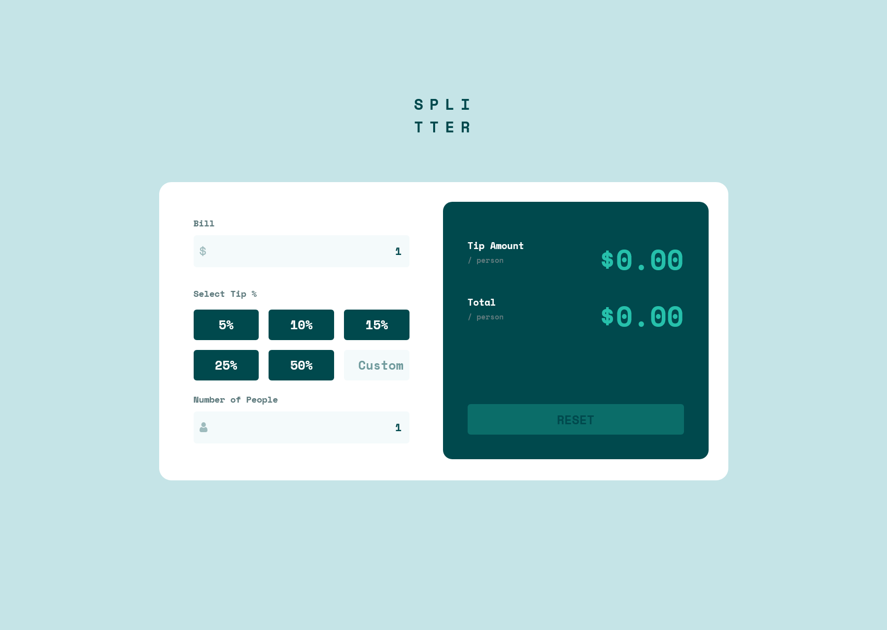

# Frontend Mentor - Tip calculator app solution

This is a solution to the [Tip calculator app challenge on Frontend Mentor](https://www.frontendmentor.io/challenges/tip-calculator-app-ugJNGbJUX). Frontend Mentor challenges help you improve your coding skills by building realistic projects.

## Table of contents

- [Overview](#overview)
  - [Screenshot](#screenshot)
  - [Links](#links)
- [My process](#my-process)
  - [Built with](#built-with)
  - [What I learned](#what-i-learned)
  - [Continued development](#continued-development)
  - [Useful resources](#useful-resources)
- [Author](#author)
- [Acknowledgments](#acknowledgments)

## Overview

### Screenshot




### Links

- Solution URL: [Solution here](https://github.com/MariaCMontO/tip-calculator-cmo)

## My process

### Built with

- Semantic HTML5 markup
- CSS custom properties
- Flexbox
- Grid
- JavaScript

### What I learned

With this project, I learned how to include javascript interactions, in this case, the blura and input events. I also learned how to usea toggle to change styles regarding a condition. Other important thing I learned is the difference between .filter and .find. I practiced the implementation of pure functions.

```js
function zeroValidation(e) {
    //Variables 
    const input = e.target
    const value = input.value.trim()
    const divLabel = document.getElementById(`div-label-${e.target.id}`)
    const existingMessage = divLabel.querySelector(".is-zero-label");

    const isInvalid = value === "0" || value === '';

    //Si es 0 o vacio se pone borde rojo
    input.classList.toggle('is-zero', isInvalid);

    if (isInvalid) {
        if (!existingMessage) {
            //Si no hay mensaje aun se pone uno
            const message = document.createElement('P')
            message.textContent = "Can't be zero";
            message.classList.add('is-zero-label')
            divLabel.appendChild(message)
        }
    } else {
        //Si hay mensaje se eliminan
        if (existingMessage) existingMessage.remove()
    }
    return isInvalid
}

//Calcular y cambia en el HTML los valores del tip amount y total
function updateTipTotal() {

    //Extraer valores de bill, number people y tip
    const billValue = getBill(bill);
    const numberPeopleValue = getNumberPeople(numberPeople)
    let tipValue = getTip();

    //Validar que ni bill ni numberPeople sea 0 o NaN
    if (isInvalidInput(billValue, numberPeopleValue)) return;

    //Calcular valores
    const tipAmountValue = calculateTipPerson(billValue, numberPeopleValue, tipValue);
    const totalValue = calculateTotalPerson(billValue, numberPeopleValue, tipValue);

    //Extraer elementos y asigan valores
    tipAmount.textContent = `$${tipAmountValue}`;
    total.textContent = `$${totalValue}`;

    //Cambiar estado del boton
    resetButton.classList.add('active')
}
```

### Continued development

I definitely want to keep developing interfaces with JavaScript functions, in order to make them more interactive.

### Useful resources

## Author

- Frontend Mentor - [@MariaCMontO](https://github.com/MariaCMontO)


## Acknowledgments